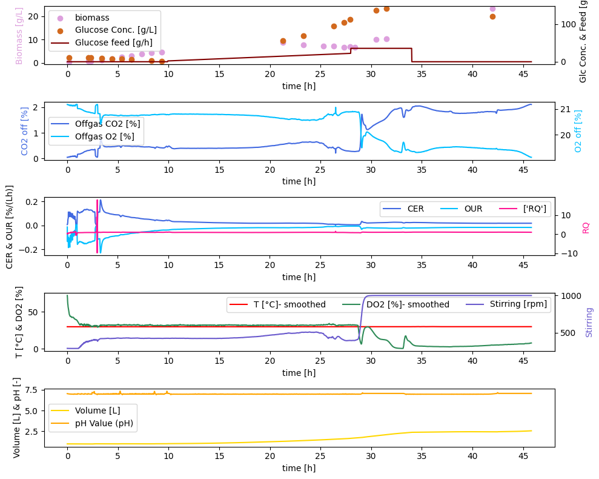
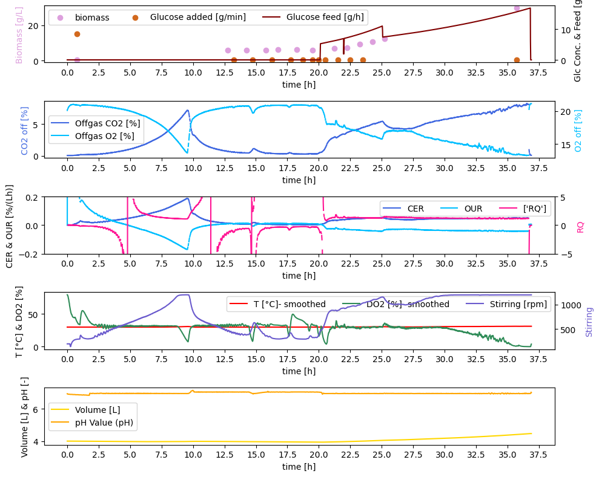

### A_preprocessing

In the pre-processing section, the fermentation data of batch no. 1 and batch no. 2 were prepared for further analysis. Based on data, a lot of conclusions about the fermentation can be conducted. Therefore, the fermentations will be described and discussed in the following.

Both experiments are segmented into a batch phase and a fed-batch phase. However, the start of the fed-batch phase starts after 10h for batch No.1 and after 20h for batch No.2.

**Discussion of Batch No.1**
- growth exponentially , stagnation and then higher growth rate again
- few samples so not exactly sure what is going on
- adding trace elements, adding glucose to exclude glucose inhibition --> overall boost
- growth limitation due to medium

when adding all the nutrients, stirring go up to mix everything, dissolved oxygen can't keep up and drops
carbon evolution rate shows that constant even though feeding and even drop but then increasing after overcoming the limitations
ph and T controlled so that not able to model
volume is just calculated - wasn't measured

**Discussion of Batch No.2**

longer batch phase, glucose is consumed very quickly based on CER
peak of CER after around 9.5h
after feeding start growth increases quickly

**Conclusion**
- many parameters are controlled such as pH, T, DO2 so we can't model it by differential equations
- only parameters we can model are biomass, substrate, co2
- for the volume we don't have data to compare it with

for learning experience we still create model and monte carlo and hybrid model but usually not like this