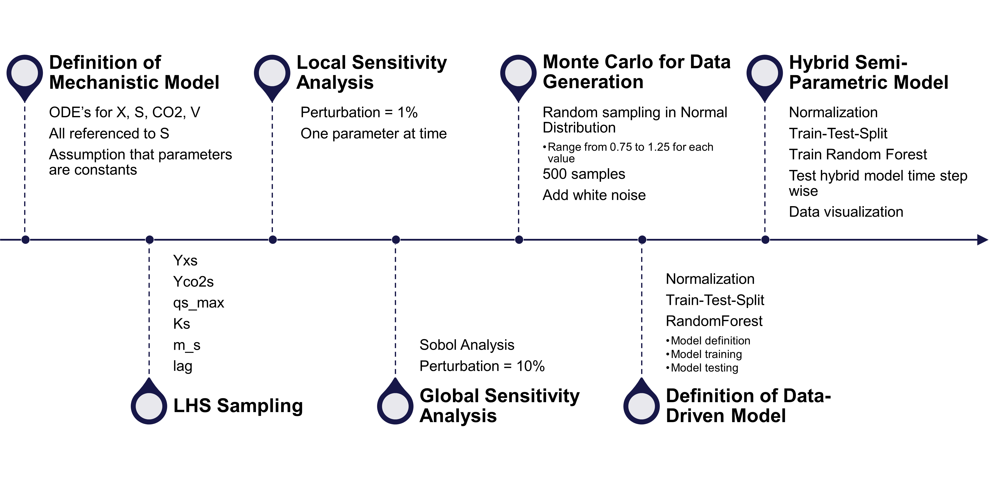

# Hybrid semi-parametric model for fermentation of Corynebacterium glutamicum

### Introduction
This project is about designing a hybrid semi-parametric model for the fermentation of *Corynebacterium glutamicum* that combines two categories of process modeling. While modeling involves translating knowledge about a given process into an abstract mathematical framework, one can distinguish between whitebox and blackbox models. White box models require a deep understanding of the process, are more transparent, and include mechanistic models. Black box models, on the other hand, are less transparent and are derived exclusively from process data.

There are also different forms of model parameterization:
Parametric models, a subset of white box models, depend on process knowledge and have a fixed number of parameters. These models offer insights ranging from physical to empirical interpretations, depending on the depth of knowledge. On the contrary, non-parametric models, rooted solely in data, require extensive data sets to build and have flexible parameters that adapt to the nature of the data.

Hybrid semi-parametric models have an advantage over traditional models that are either mechanistic or data-driven. Combining both categories of models results in a broader knowledge base with transparent and cost-effective model development. This combination enhances their potential to improve model-based process operation and design. While many challenges remain, hybrid modeling approaches are widely recognized for predicting process states more accurately while being easier to interpret than purely mechanistic or data-driven models.

The hybrid semi-parametric model developed in this project takes biomass and $CO_2$ concentration at time step t as input. The previously trained data-driven model calculates the glucose concentration for the same time step t, which is now the input to the mechanistic model. The latter calculates the biomass and the $CO_2$ concentration for the next time step t+1. This process is repeated for each time step. The choice of these parameters is due to the lack of other process parameters. In a realistic scenario, well and continuously measured parameters such as temperature, dissolved oxygen, pH and other offgases are usually entered into the data-driven model to calculate e.g. glucose concentration. Since these parameters have been controlled and kept constant, they lack the variability and changes that models thrive on to understand the correlation between input and output.

However, the goal of the project is to understand the potential and challenges of developing a hybrid semi-parametric model based on real experimental data. Despite the limited number of input parameters, insights can be gained into the adaptability of the model, its limitations, and the interplay between data-based and process-based approaches in complex systems.

### Structure

Each file starts with a letter which should represent the steps of development within the developing of the model. Each step contains a .py file where the model is defined and other relevant functions. The functions are then imported to the jupyter notebook, where the output is further processed.

- config
    - parameters.yml (fermentation parameters are defined)
- data
    - batch_no1 (raw data, preprocessed dataset, parameter estimation, generated batches)
    - batch_no2 (raw data, preprocessed dataset, parameter estimation, generated batches)
- images
- **A** Data Preprocessing.
- **B** Mechanistic Models.
- **C** Parameter Estimation.
- **D** Sensitivity Analysis.
- **E** Data Generation
- **F** Random Forest
- **G** Hybrid Model
- requirements.txt (pip install -r requirements.txt - to install all required packages)

Each section has its own .py file that contains functions such as the mechanistic models, sampling, or plotting. Second, Jupyter notebooks (.ipynb) are used for explanations, discussions, and the main code. In some sections there is an additional .md file that contains text only and gives more information about the section content.

### Workflow with Git
Everyone is working in their own branch (debbi & marc). From there changes can be merged with the main branch. Follow the step by step guide:
- commit and push all changes to your own branch
- open a new **Git Bash** terminal
- switch from your branch to the main branch: **git checkout main** 
- get the latest updates: **git pull**
- merge the 2 branches: **git merge <branch_name>**
- in the vs code window the merge conflict will pop up
    - for each conflict in a file you can see your own and the main branch version
    - you can decide which version you would like to keep
    - you can show the comparison for a better visualization
- stage the solved conflicts
- commit the changes to the main branche
- to continue working in your own branch
    - checkout to your own branch: **git checkout <branch_name>**
    - pull the copy of the main branch: **git pull origin main**